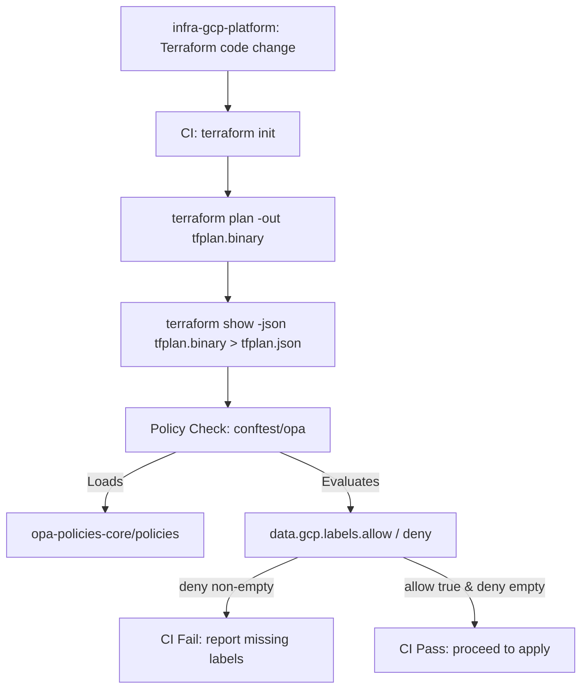
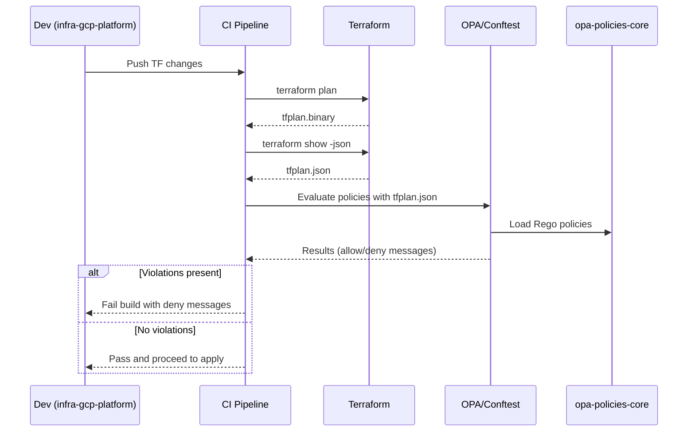

### Purpose Split

* `opa-policies-core` hosts OPA/Rego polices and tests (eg. enforcing required lables on cloud provider storage.
* `infra-gcp-platform` Owns Terraform code, planning, and CI/CD that applies infrastructure; it consumes the policies as a policy gate.

## Integration Point

- `infra-gcp-platform` produces a Terraform plan and converts it to JSON (`terraform show -json`).
- CI runs policy evaluation using Conftest or OPA against `opa-policies-core/policies`.
- Policies read `input.resource_changes` 
- If any `google_storage_bucket` is missing required labels (`environment`, `owner`), the build fails with clear messages.

Typical Lifecycle: 

- Policy authors evolve rules in `opa-polices-core` with opa test.
- Infra authors change Terraform
- CI in infra repo fetches/points to the policy bundle and gate merges/deploys.

Operational flow (CI/CD)

1. Developer pushes Terraform changes to `infra-gcp-platform
2. CI runs: terraform init, terraform plan, terraform show
3. CI runs policy check: conftest or opa eval
4. If violations exist, CI fails with actionable messages; otherwise proceeds to apply.

## Data/contract between repos
* Input document: Terraform plan JSON containing `resource_changes` entries.
* Policy package: gcp.labels
* Entry points: data.gcp.labels.allow (boolean), data.gcp.labels.deny (collection of violation messages)
* Current enforced rule(s) 

#### Flow diagram

#### Sequence diagram

