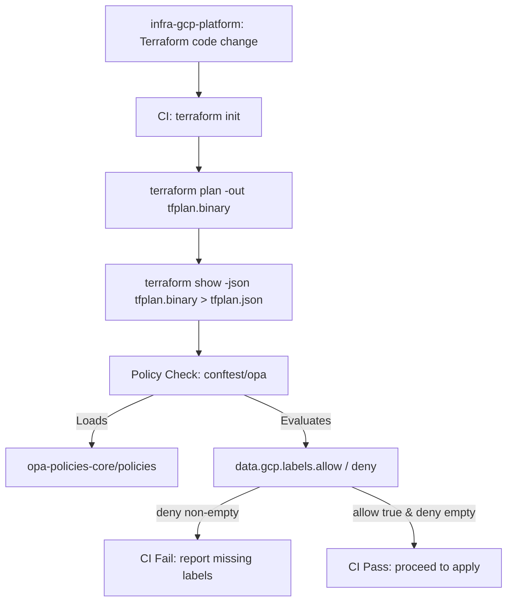
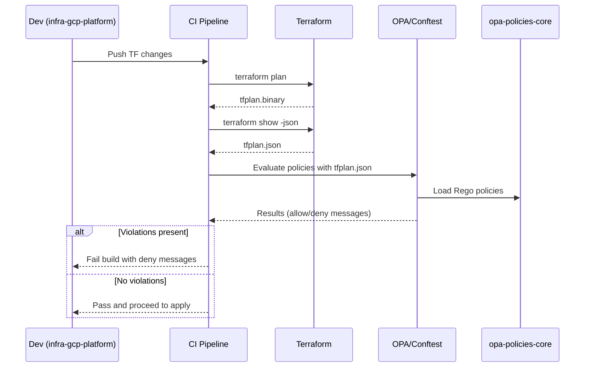

### Integration with `infra-gcp-platform`

This repository (`opa-policies-core`) provides OPA/Rego policies that are consumed by your Terraform repository `infra-gcp-platform` during CI/CD to gate changes.

- `infra-gcp-platform` produces a Terraform plan and renders it to JSON (`terraform show -json`).
- CI runs policy evaluation using Conftest or OPA against `opa-policies-core/policies`.
- If any `google_storage_bucket` is missing required labels (`environment`, `owner`), the build fails with clear messages.

Typical CI flow:

```bash
terraform init
terraform plan -out tfplan.binary
terraform show -json tfplan.binary > tfplan.json
conftest test --input terraform --policy ../opa-policies-core/policies tfplan.json
# or
opa eval -I -d ../opa-policies-core/policies -i tfplan.json "data.gcp.labels.deny"
```

#### Flow diagram



#### Sequence diagram


